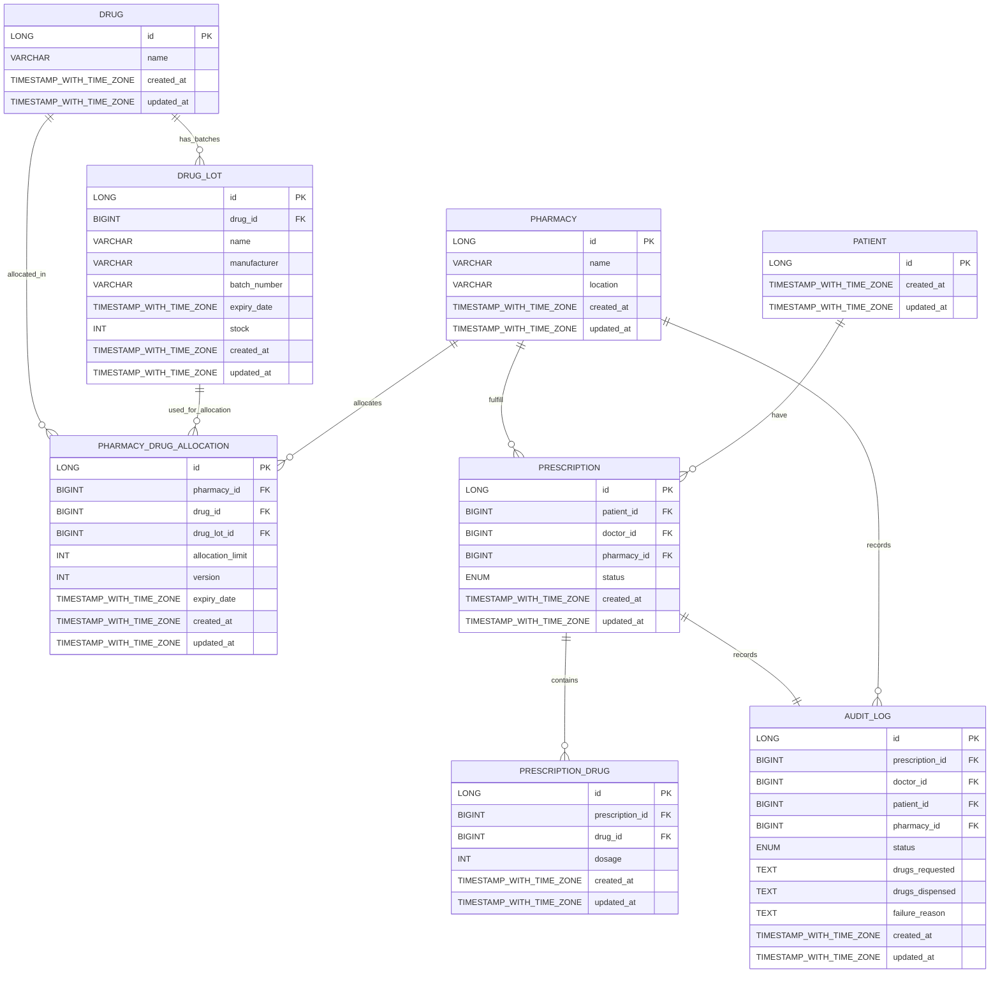

# PharmaFlow — Pharma Supply Chain & Prescription Fulfillment System

---
## 1. Project Overview

PharmaFlow is a Spring Boot-based microservice for managing the pharmaceutical supply chain and prescription fulfillment lifecycle. It provides:

- **Drug Inventory** with batch and expiry tracking
- **Pharmacy Allocations** to enforce per-pharmacy drug limits
- **Prescription Management**: create, validate, and fulfill prescriptions (all-or-nothing)
- **Optimistic-lock concurrency** on allocations
- **Audit Logging** of every prescription attempt (success or failure)
- **RESTful API** documented with Swagger/OpenAPI

Key components include Spring Data JPA (PostgreSQL), Lombok-powered entities, AOP-based audit aspect, and a Snowflake ID generator for distributed primary keys.
Environment required:
- **Java 17+ SDK** (tested on OpenJDK 21)
- **PostgreSQL 14+** database
- **Gradle 8+** (or use the provided Gradle Wrapper)
- **Docker** (optional, for local Postgres via `docker-compose`)
- **IDE**: IntelliJ IDEA, Eclipse, VS Code, etc.

---

## 2. Project Structure

```text
pharma-system/
├── deploy/
│   ├── docker
│   │   └── pg/
│   └── helm/
│       └── pharma/
│           └── templates/
├── src/
│   ├── main/
│   │   ├── java/
│   │   │   └── com/sanofi/pharma/
│   │   │       ├── aop/
│   │   │       ├── config/
│   │   │       ├── controller/
│   │   │       ├── dao/
│   │   │       │   ├── impl/
│   │   │       │   └── repository/
│   │   │       ├── dto/
│   │   │       ├── exception/
│   │   │       ├── model/
│   │   │       ├── service/
│   │   │       └── util/
│   │   └── resources/
│   │       ├── application.yml
│   │       └── sql/
│   └── test/
│       └── java/com/sanofi/pharma/
│           ├── controller/
│           ├── dao/
│           ├── service/
│           └── integration/
├── build.gradle
├── settings.gradle
├── README.md
└── config/
    ├── checkstyle/
    │   └── checkstyle.xml
    ├── pmd/
    │   └── ruleset.xml
    └── spotless/
        └── license.java
```
- **deploy** : docker & k8s files to build service and related components, deploy to k8s  
- **src/main** : biz files based on MVC structure
- **src/test/integration** : integration test examples 
- **src/test/service** : unit test examples
- **src/config** : lint settings file
---

## 3. Entity Relationship Diagram


---
## 4. API Documentation

- Swagger UI: [http://localhost:8080/swagger-ui.html](http://localhost:8080/swagger-ui.html)
- OpenAPI spec: [http://localhost:8080/v3/api-docs](http://localhost:8080/v3/api-docs)

The API covers endpoints for:

- Drug inventory, batch & expiry operations
- Pharmacy allocations (view, update, concurrency handled)
- Prescription creation, validation, fulfillment (all-or-nothing)
- Audit log query

See Swagger UI for request/response schemas and try out the endpoints.

---

## 5. Setup Instructions

1. **Clone the repo**
   ```bash
   git clone https://github.com/your-org/pharmaflow.git
   cd pharmaflow
   ```

2. **Start PostgreSQL** (local or Docker)
   - **Option 1: Docker Compose**
     ```bash
     docker-compose up -d
     ```
     _This will launch a local Postgres instance with credentials as per `docker-compose.yml`._
   - **Option 2: Manual**
     - Start your own Postgres 14+ instance and create a database (e.g. `pharmaflow`).

3. **Configure database connection**
   - Edit `src/main/resources/application.yml` (or set environment variables) to match your Postgres credentials.
   - Example:
     ```yaml
     spring:
       datasource:
         url: jdbc:postgresql://localhost:5432/pharmaflow
         username: pharma
         password: password
     ```

4. **Build the project**
   ```bash
   ./gradlew build
   ```

5. **Run database migrations**
   ```bash
   ./gradlew flywayMigrate
   ```
   _Or let Spring Boot auto-run Flyway on startup (default)._

6. **Start the application**
   ```bash
   ./gradlew bootRun
   ```
   _Or run the generated JAR:_
   ```bash
   java -jar build/libs/pharma-system-*.jar
   ```

---

## 4. Running Tests

Run all unit and integration tests using:

```bash
./gradlew test
```

---

## 6. Key Features & Design Notes

- **Optimistic Locking**: Per-pharmacy allocation updates use version fields and JPA's `@Version` to prevent lost updates.
- **Audit Logging**: Every prescription fulfillment attempt is logged (AOP aspect), including both success and failure, with timestamps and user.
- **All-or-Nothing Fulfillment**: Prescriptions are only fulfilled if all requested drugs/batches are available; otherwise, none are allocated.
- **Snowflake ID Generation**: All entities use distributed, sortable 64-bit IDs for scalability.
- **Security**: JWT-based authentication filter for all endpoints (see `application.yml` for JWT config).
- **Extensibility**: Modular service/repository structure, DTO mapping, and OpenAPI documentation.

---

## 7. Useful Gradle Commands

- **Build the project:**  
  `./gradlew build`
- **Run the app locally:**  
  `./gradlew bootRun`
- **Run all tests:**  
  `./gradlew test`
- **Apply database migrations (Flyway):**  
  `./gradlew flywayMigrate`
- **Generate OpenAPI docs:**  
  `./gradlew openApiGenerate`
- **Clean build artifacts:**  
  `./gradlew clean`

---

For contribution guidelines, troubleshooting, or further documentation, see the `docs/` folder or open an issue.